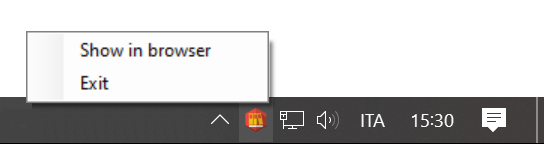

# ASP.NET Core Desktop application (single instance)
This is a demo solution of an ASP.NET Core running on the Windows desktop in the most user-friendly way.

 * The `src/AspNetCoreSingleInstance.Web` project is the ASP.NET Core application. Please note that in the `.csproj` file, its `OutputType` has been set to `Library`;
 * The `src/AspNetCoreSingleInstance.Host` project is a Winforms application whose main purpose is to show a notification icon so that the user can exit the application or launch it in the browser.
   * This project references the ASP.NET Core project and it's also responsible for starting and stopping its web host.

## Getting started
Open this project with Visual Studio Code and hit `F5` to start debugging. Two launch profiles have been provided, one for each of the two projects:
 * .NET Core Launch (web)
 * .NET Core Launch (host)

Please see the [src/AspNetCoreSingleInstance.Host/WebHostApplicationContext.cs]([src/AspNetCoreSingleInstance.Host/WebHostApplicationContext.cs]) since all the meaningful start/stop logic is in there.

## Credits
 * Free icon by GraphicLoads from IconArchive [https://iconarchive.com/show/polygon-icons-by-graphicloads/files-icon.html](https://iconarchive.com/show/polygon-icons-by-graphicloads/files-icon.html)
 * Doing a NotifyIcon the proper way [https://www.codeproject.com/Tips/627796/Doing-a-NotifyIcon-Program-the-Right-Way](https://www.codeproject.com/Tips/627796/Doing-a-NotifyIcon-Program-the-Right-Way)